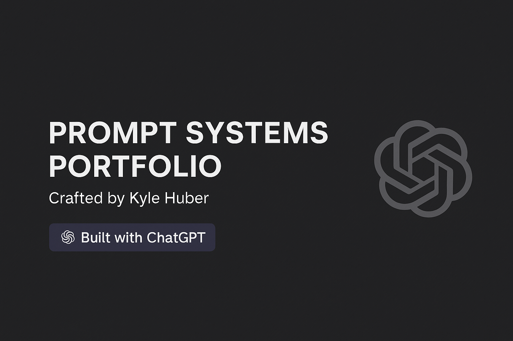

# Prompt Systems Portfolio  
Crafted by Kyle Huber  

This portfolio showcases applied prompt design systems I've developed using GPT-4o, GPT-5, and other LLMs. Each use case is structured for clarity, transferability, and real-world relevance.

---

## Featured Prompts

### 1. 'Evergreen' Resume Creation Workflow  
**Purpose:** Streamlines high-consistency, voice-aligned resume generation; augmenting the user's most frequently disclosed skills and attestations.

**Why It Matters:** Enables reusable job application artifacts; maintaining authenticity and simplifying future updates.
[Download Deck]()

---

*Let's connect if you're exploring LLM workflows or prompt system design -> [LinkedIn](https://linkedin.com/in/kyle-james-my-filenames)*
